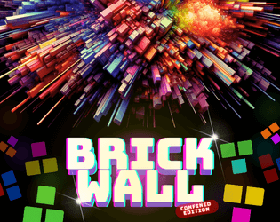
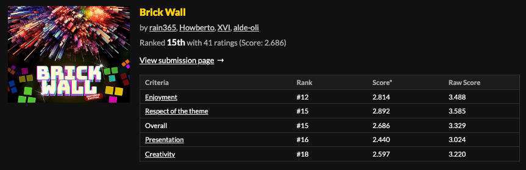
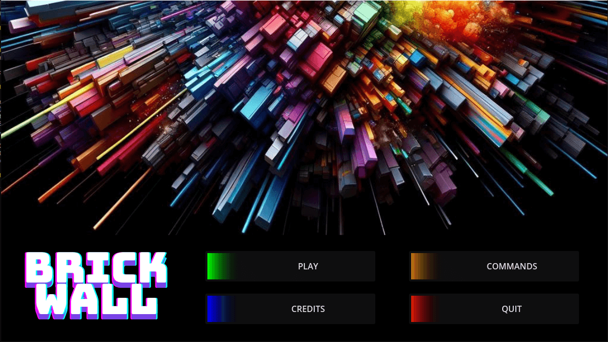
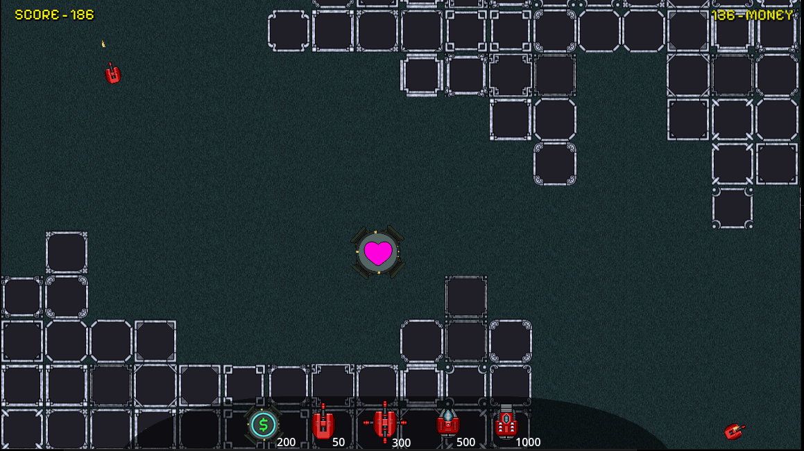
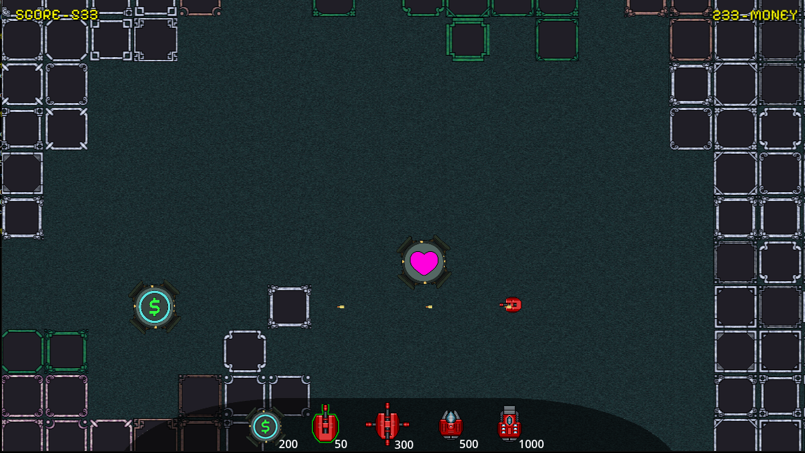
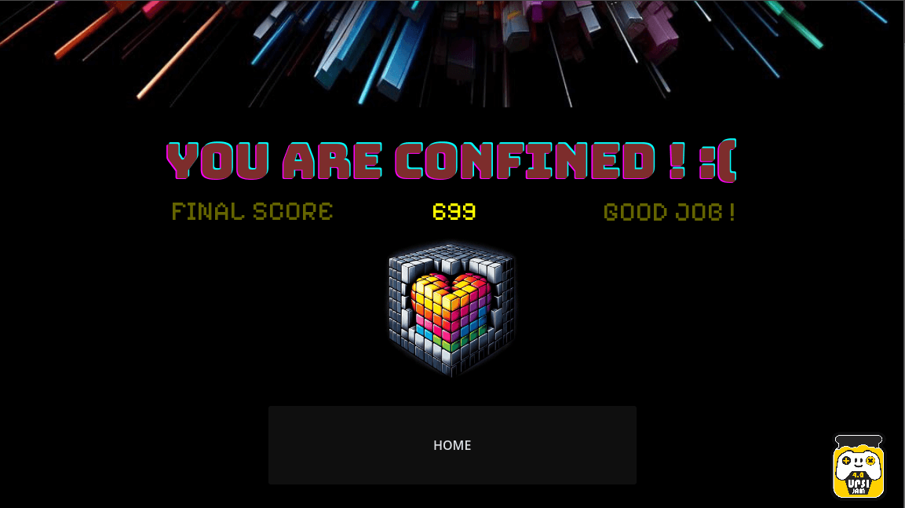

 
	

 
 

# GameJam - UPSI JAM 4.0

> From 22-03-2024 at 5:00pm to 24-03-2024 at 12:00pm

	<table style="width: 100%">
		<tr>
			<td align="center">
				
			</td>
			<td align="center">
				
			</td>
			<td align="center">
				
			</td>
		</tr>
	</table>

## Summary

 
	In the age when shadows danced with malevolence and darkness threatened to engulf the very essence of existence, there stood a bastion of humanity, a citadel forged by the hands of mortal ingenuity and blessed by my divine providence. Yet, even in the midst of this defiance, the Forces of Darkness devised a wicked scheme to snare the remnants of mankind within their sinister grasp. These walls, imbued with a sentience as ancient as time itself, rose like towering monoliths, their very presence a testament to the insidious power of the abyss. Their purpose was clear: to ensnare and confine, to shackle the spirit of mankind within a prison of despair. But lo and behold, my prideful creation, the Automated Gun Turrets, stood vigilant, their metallic forms gleaming with the promise of righteous fury. Programmed with the knowledge of ages past, they unleashed a barrage of thunderous retribution upon the encroaching walls, their ammunition a symphony of defiance against the encroaching darkness. Yet, the walls, cunning and relentless, seemed impervious to the onslaught. With each volley, they absorbed the punishment, their stony facades unyielding against the onslaught of mortal invention. The clash of titanic forces echoed through the desolate wasteland, a testament to the eternal struggle between light and shadow. As the battle raged on, uncertainty clouded the hearts of those who beheld the spectacle. Would the indomitable walls emerge victorious, ensnaring humanity within their suffocating embrace? Or would the relentless fury of the Automated Gun Turrets prove triumphant, safeguarding the fragile remnants of mankind from the encroaching darkness? Alas, the outcome remained shrouded in the mists of uncertainty, a tale yet unfinished in the annals of time. But fear not, for even in the face of such dire adversity, the flame of hope burns eternal, a beacon of defiance against the encroaching shadows. And so, the saga of the Unyielding Walls and the Automated Sentry Standoff shall be forever etched into the tapestry of existence, a testament to the indomitable spirit of mankind and the enduring legacy of my divine sovereignty.

 
 

# Itch.io page

 
	

 
 

# Usage

> Playbable on windows only!

- Download the BrickWall.zip from this [link](https://rain365.itch.io/brick-wall)
- Extract it
- Launch the BrickWall.exe
- Enjoy

 
 

# Screenshots

	<table style="width: 75%">
		<tr>
			<td style="align: center">
				
			</td>
			<td style="align: center">
				
			</td>
		</tr>
		<tr>
			<td style="align: center">
				
			</td>
			<td style="align: center">
				
			</td>
		</tr>
	</table>

  

# Authors

<a href="https://github.com/Rain36522">Rain36522</a>
 
<a href="https://github.com/alde-oli">alde-oli</a>
 
<a href="https://github.com/DavePie">DavePie</a>
 
<a href="https://github.com/aceyzz">aceyzz</a>
